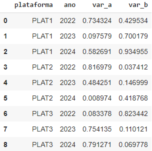
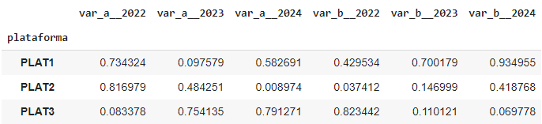
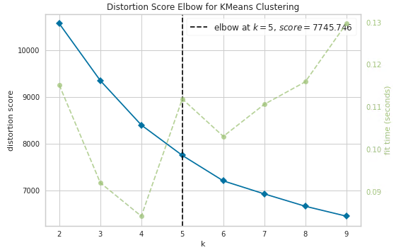
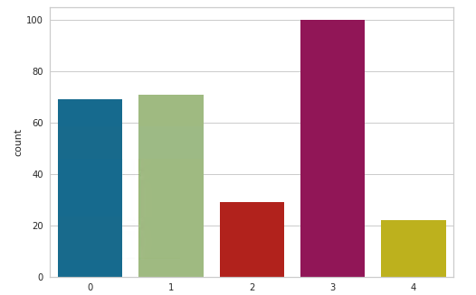
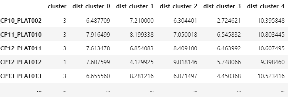
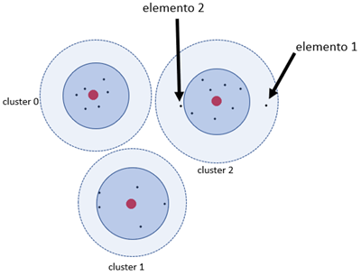
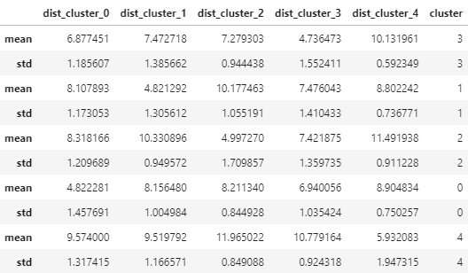
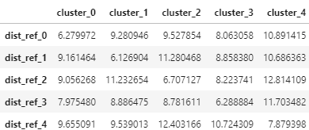

# Detectção de anomalias no processo de estimativa de reservas

#### Aluno: [Leonardo Cardoso Vicente] (https://github.com/lcvicente).
#### Orientador: [Leonardo Forero Mendonza] (https://github.com/leofome8).

---

Trabalho apresentado ao curso [BI MASTER](https://ica.puc-rio.ai/bi-master) como pré-requisito para conclusão de curso e obtenção de crédito na disciplina "Projetos de Sistemas Inteligentes de Apoio à Decisão".

---

# Resumo

A estimativa de reservas é uma importante atividade na indústria de petróleo e gás. Por meio dela, as empresas deste ramo avaliam a economicidade de seus projetos de produção e investimento. Entidades governamentais exigem que as empresas realizem este processo seguindo metodologias certificadas e reconhecidas internacionalmente. Empresas que possuem ações listadas em bolsas de valores, periodicamente precisam também divulgar ao mercado essas informações. As reservas estão associadas à capacidade da empresa em gerar receita através da venda da produção.

As entradas deste processo consistem em planejamentos futuros (projeções) de diversas disciplinas tais como: custos operacionais, custos com abandonos, investimentos (ex.: perfuração de novos poços e entrada de novas unidades) e curvas de produção. Estas projeções são classificadas seguindo critérios estabelecidos em metodologias de referência, defindo as parcelas que correspodem a cada classe de reserva (que possui algumas variações dentro dos grupos de classe Provada, Provável, Possível e Recursos Contingentes).

A incerteza é um fator predominante. A curva de produção, que se transforma em receita, deve considerar uma base de preços de referência (ex.: _petróleo brent_), assim como uma taxa de conversão (câmbio) para a moeda utilizada, que também afeta projeções de custos e investimentos por exemplo.

Além da incerteza inerente ao processo, outros fatores contribuem para sua complexidade:
- Cada grupo de variáveis se divide em várias séries específicas.
- As análises devem considerar cenários de incerteza (ex.: otimista, pessimista, realista).
- Cada análise deve ser feita para cada plataforma existente, considerando ainda a multiplicação de dimensão quando se considera a zona de produção (variável relacionada a reservatórios).
- O processo deve estar alinhado com outros processos paralelos da empresa.

Sobre os dados tratados, é possível afirmar que possuem um comportamento implícito. Individualmente as séries temporais possuem um padrão minimamente definido e conhecido. Outras relações não tão óbvias podem existir nos dados.

O objetivo do trabalho foi encontrar e analisar comportamentos implícitos nos dados e utilizar este comportamento para identificar outliers em novas projeções. Como projeção subentende-se uma matriz na qual cada linha representa um ano e cada coluna representa uma variável.

A metodologia desenvolvida contempla a comparação uma nova projeção (```matriz_p```) com comportamentos padrões encontrados em dados históricos, medindo o “grau de aderência” (confiabilidade) de ```matriz_p``` com cada um dos padrões existentes. A projeção é rotulada como como _outlier_ caso seu grau de aderência esteja acima de um limite calculado.

Das abordagens existentes no universo de ciência de dados para detecção de anomalias, foi escolhido o algoritmo _K-Means_ para tratar o problema. A escolha foi motivada por:

- Contexto _não supervisionado_ do problema (ausência de conhecimento prévio de exemplos classificados como outliers / não outliers).
- Capacidade do algoritmo em descrever a representação do conhecimento.

A identificação de um elemento como anômalo é feita a partir do cálculo de distâncias para os centroides comparado a uma estatística previamente calculada, através de um mecanismo que considera a distância do elemento para todos os centroides, detalhada na sessão "Treinamento para identificação de anomalias".

Por se tratar de dados sensíveis, este documento trata das técnicas utilizadas omitindo os dados processados.

# Contexto do problema

De forma resumida os dados originais são agrupados em 9 categorias, representando as variáveis econômicas (ex.: custos e investimentos) e volumétricas (ex.: produção de óleo e gás). Essas categorias possuem valores para cada período da série temporal. A tabela abaixo traz um exemplo hipotético do esquema de representação utilizado considerado um período temporal estendido a 30 anos. As células indicadas com ```0,00``` recebem os valores das séries.
 
| Ano | VAR_1 | VAR_2 | VAR_3 |  ...  | VAR_9 |
|:---:|-------|-------|-------|-------|-------|
| 1   | 0,00  | 0,00  | 0,00  | 0,00  | 0,00  |  
| 2   | 0,00  | 0,00  | 0,00  | 0,00  | 0,00  |  
| 3   | 0,00  | 0,00  | 0,00  | 0,00  | 0,00  |  
| 4   | 0,00  | 0,00  | 0,00  | 0,00  | 0,00  |  
| ... | ...   | ...   | ...   | ...   | ...   |  
| 30  | 0,00  | 0,00  | 0,00  | 0,00  | 0,00  |  

A existência de um mecanismo que melhore a confiabilidade sobre os dados processados pode ser útil para aumentar a qualidade do processo como um todo. Uma série de etapas e detalhes presentes no processo resultam em modificações e ajustes nestas projeções, aumentando a chance de erros.

Mecanismos determinísticos existentes nos sistemas deste processo tratam uma variedade de inconsistências possíveis. Um exemplo típico de inconsistência é: caso exista valor válido (maior que zero) para a variável ```VAR_1``` em determinado ano, obrigatoriamente deve haver valor válido para a variável ```VAR_2```.

No entanto, mesmo atendendo os requisitos de consistência, é possível que os dados contenham comportamentos que necessitem de atenção. Um dígito equivocado a mais em um determinado valor, por exemplo, pode causar uma distorção relevante na análise final e ser de difícil identificação.

Nesse contexto comportamental dos dados que o trabalho se propôs a atuar, através de um algoritmo que identifique distorções em relação a padrões existentes nos próprios dados.

# Tratamento dos dados

Em geral, o processo de análise em ciência de dados possui uma etapa de pré-processamento visando realizar ajustes nos dados e deixá-los em formato adequado. Através de um conhecimento prévio da estrutura e representação dos dados para o negócio e tendo em vista o objetivo da análise, foram aplicadas transformações utilizando técnicas de seleção de atributos, criação de _features_, normalização e preenchimento de valores ausentes. A motivação para cada uma dessas etapas segue explicada neste tópico.

## Representação dos dados para análise

Antecedendo as transformações realizadas, é importante destacar como foi planejada a representação dos dados para a análise proposta. O exemplo hipotético e simplificado abaixo traz uma representação dos dados no formato original desta análise. Neste exemplo existem dados de três plataformas (PLAT1, PLAT2 e PLAT3). Os valores representados por `var_a`e `var_b` estão anualizados (coluna `ano`).



A ideia é comparar o comportamento de valores da cada plataforma para identificar comportamentos anormais. Seguindo esta linha, pode-se afirmar que o exemplo contém três conjuntos de valores (cada conjunto referenciando uma plataforma). Para a análise, os dados foram transformados para o formato da figura abaixo, com o elemento de comparação indexado (coluna `plataforma`) e tendo seus dados representados em linhas, favorecendo assim a comparação entre os elementos.



definição de atributos
O mecanismo de identificação de anomalias deste trabalho utiliza Projeções de curvas de plataformas para extração de conhecimento. 

A extração do conhecimento falar aqui da comparação com dados

citar mais sobre o passo a passo para ajustes no dado. Colocar gráfico de box plot

falar do preenchimento de dados

Apesar das projeções de séries terem comportamentos parecidos entre diferentes plataformas, a dimensão temporal dos dados pode variar. Plataformas em estágio final de vida útil podem possuir operação por mais 2 ou 3 anos. Em outro extremo, plataformas novas podem ter operação prevista de 30 ou mais anos. Como o processo de estimativa de reserva é feito considerando o planejamento futuro, dados do passado não são considerados.

Em _Machine Learning_, um dos requisitos é que os exemplos tenham dimensão padronizada. Para ajustar os dados neste requisito, foi definido um limite temporal a ser considerado. A partir dos dados históricos usados como treinamento, é verificado a dimensão mediana das projeções de cada plataforma. Esta dimensão somada ao desvio padrão define a dimensão padrão dos dados de entrada (ex.: dimensão padrão de 25 anos).

Para plataformas que não possuam a projeção completa (ex.: projeção de apenas 2 anos), é considerado que os dados existentes correspondem aos anos finais da série. Para manter o padrão de dimensão, os anos “faltantes” são preenchidos com a mediana dos valores existentes em séries de outras plataformas. Este preenchimento fictício não trouxe prejuízo para o objetivo da análise, uma vez que os dados foram preenchidos com um comportamento mediano (não anômalo).

# Treinamento para identificação de anomalias

Dados históricos de processos passados foram utilizados como referência para o modelo extrair conhecimento. Neste trabalho, este processamento foi feito considerando duas séries representando custos operacionais e produção de fluidos.

Inicialmente o algoritmo gera uma nova projeção considerando a razão entre as duas séries. Após normalização de valores, os dados são submetidos ao algoritmo _KElbow_ buscando identificar quantidade ideal de clusters para segmentar os dados.
```
from yellowbrick.cluster import KElbowVisualizer
from sklearn.cluster import KMeans

km = KMeans()
visualizer = KElbowVisualizer(km, k=(2, 10))
visualizer.fit(df_flat)
visualizer.show();
```



Em seguida, os dados são processados pelo algoritmo K-Means utilizando a quantidade de clusters definida pelo Elbow.
```
n_clusters = visualizer.elbow_value_
km = KMeans(n_clusters=n_clusters).fit(df_flat)
df_flat['cluster'] = km.labels_

sns.countplot(x=km.labels_)
```


 
Além da associação de cada elemento a um cluster, é calculada distância euclidiana para cada centroide. Desta forma, é computada a distância do elemento tanto para seu cluster quanto para os demais. Na figura abaixo, cada linha representa uma plataforma e as colunas se referem ao cluster associado e às distâncias para cada centroide. Conforme funcionando do _K-Means_, observa-se a menor distância de cada elemento (colunas _dist_) corresponde ao seu cluster associado (coluna _cluster_)


 
Uma forma de identificar anomalias é considerar um elemento como anômalo caso a distância para seu centroide exceda um limite padrão. O limite padrão para cada centroide ```c``` pode ser definida como:

```
# Pseudo-código
x = 1
distancias = []
Para cada elemento "e" associado ao centroide "c":
    armazena a distância euclidiana de "e" para "c" ao fim na lista "distancias"
limite[c] = mediana(distancias) + x * desvio_padrao(distancias)
```
Podendo ```x``` ser definido como um fator de sensibilidade permitindo identificar mais elementos ou menos elementos como anomalia.

Este trabalho propôs uma metodologia ajustada, considerando também a distância para outros centroides. Na figura abaixo, considerando que o raio mais próximo aos centroides é a zona de confiança (mediana + desvio padrão) e o raio maior é a fronteira da área do cluster, os dois elementos destacados seriam rotulados como anômalos. No entanto, o elemento 2 possui mais similaridade com os outros centroides em comparação ao elemento 1, que está mais distante dos demais centroides.


 
Neste caso, a distância do elemento 2 para o seu centroide pode ser compensada por sua leve proximidade com outros centroides, tornando-o um elemento “não anômalo”. Já a anomalia do elemento 1 é reforçada devido sua distância para todos os centroides.

O processo se resume em calcular um valor denominado “distância relativa total” para cada um dos elementos. A partir da distribuição estatística desta distância, os elementos que possuem maiores distâncias são considerados anômalos. O cálculo é feito no seguinte fluxo:

1.	Calcular a distância euclidiana de cada elemento para cada centroide

2.	Calcular estatística dos elementos em relação a cada centroide
    ```
    # Pseudo-código
    Para cada centroide "c": # Percorre cada centroide e o referencia na variável c
        elementos = Selecione os elementos associados ao centroide c
        Para cada centroide "k": # Percorre cada centroide e o referencia na variável k
            Calcule a mediana e desvio padrão de "elementos" considerando suas distâncias para k
    ```
    Ao final, deste processo, obtém-se resultados como os exemplificados abaixo.

    

    [colocar histograma]
    
3.	Identificar distância de referência para cada centroide somando as estatísticas calculadas no passo anterior (mediana + desvio padrão)

    

4.	Calcular a distância relativa de cada elemento para cada centroide
    ```
    # Pseudo-código
    Para cada elemento "e":
        k = Verificar o cluster que o elemento "e" está associado
        Para cada centroide "c":
            distancia_relativa[e,c] = dist_euclid[e,c] / dist_refer[k, c]
    ```
    A fórmula aplicada neste passo representa a razão entre a distância de cada elemento ```e``` para uma distância referencial entre o centroide ```c``` e os elementos do centroide ```k``` (centroide associado ao elemento ```e```).
    
    Resultados próximos ou maiores que 1 representam uma distância relativa alta em relação à amostra.
    
    Este passo realiza uma normalização das distâncias dos elementos para os centroides, expressando-as de forma proporcional às distribuições das distâncias observadas no uninverso amostral.

5.	Calcular a distância relativa total para cada elemento
    ```
    # Pseudo-código
    Para cada elemento "e":
        distancia_relativa_total[e] = 0
        Para cada centroide "c":
            distancia_relativa_total[e] += distancia_relativa[e,c]
    ```
    
6.	Calcular a distância relativa global a partir da estatística (mediana + desvio padrão) do vetor resultante do _passo 5_
    ```
    # Pseudo-código
    distancia_relativa_global = mediana(distancia_relativa_total) + desvio_padrao(distancia_relativa_total)
    ```
O valor de ```distancia_relativa_global``` é usado para identificar anomalias. Elementos cuja ```distancia_relativa_total``` sejam maiores que ```distancia_relativa_global``` são considerados anômalos.

A figura abaixo exemplifica os valores de cada elemento calculados neste processo.


# Identificação de anomalias em dados não treinados

O processo explicado no item 4 tem como premissa que os dados de treinamento são confiáveis, possuindo nenhuma ou pouca anomalia.

Para novos dados, o fluxo de tratamento dos dados deve utilizar do conhecimento formado na etapa de treinamento, que se resume em usar a memória dos parâmetros definidos no passo de treinamento (normalizações, associação a clusters e estatísticas de distâncias) para identificar as anomalias.

# Resultados e conclusões

Os resultados demonstraram uma boa aplicabilidade da metodologia ao processo. Além da identificação de comportamentos anômalos, foi possível também identificar os comportamentos predominantes nos dados.

Era esperado que alguns dados legítimos fossem rotulados como anômalos, e esta expectativa se confirmou. No entanto, esta situação não invalida a metodologia, uma vez que se trata de particularidades pontuais em alguns dados.

A metodologia ajustada de uso do algoritmo K-Means para identificação de anomalias teve motivação em considerar as distâncias de um elemento comparado a todo universo amostral e não somente ao seu cluster. Embora tenha produzido bons resultados, esta metodologia precisa ser testada de forma mais exaustiva para ter sua eficiência avaliada.

Para o objetivo deste trabalho, todo o universo de dados foi utilizado no contexto de treinamento. Entretanto, como possível adoção desta metodologia no processo, o tratamento dos dados está sendo adaptado para considerar uma etapa de treinamento e outra de deteção. Está sendo considerado também rodar o algoritmo para cada combinação de séries, ampliando o escopo para todo o universo de dados e trazendo outras medidas de análise.

Como evolução deste trabalho, é pretendido testar outras metodologias de identificação de anomalias como auto-encoders e método de somas acumulativas (cumsum).
